CUDA Path Tracer
================

**University of Pennsylvania, CIS 565: GPU Programming and Architecture, Project 3**

* Liang Peng
* Tested on: Windows 10, i7-6700HQ @ 2.6GHz 2.6GHz 8GB, GTX 960M (Personal Laptop)

### Feature
* [x] Ray Scattering
  * [x] Diffuse
  * [x] Refraction
  * [x] Specular Reflection
  * [x] Glossy Reflection
* [x] Depth of Field
* [x] Stratified Antialiasing
* [x] Performance Analysis

### Overview
 
The image is rendered by a path tracer on GPU, with trace depth 8 and 5000 samples per pixel. Features include diffuse, glossy, specular reflection, refraction, depth of field, and stratified antialiasing. The image is produced by averaging the results of all large amount of iterations. In each iteration, the camera will shoot a ray through each pixel and intersect with the scene objects. Based on the material at the intersection point, each ray will change color and be reflected towards certain direction and continue tracing. As a ray reaches it trace depth, its color will be accumulated to compute the final color.

### Ray Scattering
* Lambert Diffuse

Trace Depth 2, SPP 1000 | Trace Depth 8, SPP 1000
--- | ---
 | 
_observation_ Images rendered with deeper trace level appear darker, which is due to the calculation of ray color. The resulted color is calculated by multiplying the material color of all intersections along the path.

* Refraction

Refraction 1, SPP 1000 | Refraction 2, SPP 5000
--- | ---
 | 
_observation_ Since large amount of paths are traced, caustics produced by refraction are free.

* Specular Reflection

Trace Depth 2, SPP 1000 | Trace Depth 8, SPP 1000
--- | ---
 | 

* Glossy Reflection

Less Glossy Floor, SPP 3000 | Glossier Floor, SPP 3000
--- | ---
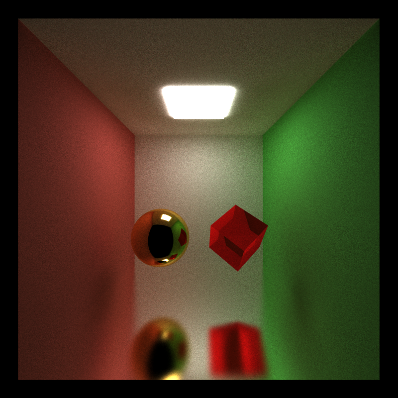 | 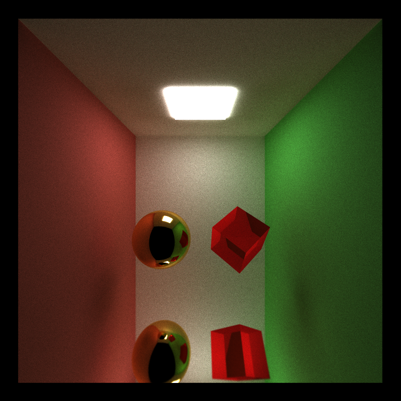
_obervation_ For different types of material, glossiness can be adjusted by tuning the specular exponent. Larger exponent produces reflection closer to mirror.

### Depth of Field

Depth of Field, Far Focal | Depth of Field, Near Focal
--- | ---
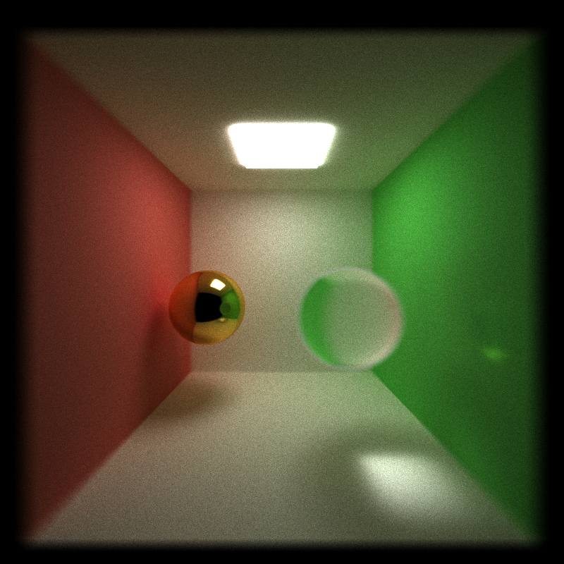 | 
_obervation_ There are 2 parameters we can play around with in terms of depth of field, lens radius and focal distance. Larger lens radius produces stronger DoF effect. Focal distance affects the distance the virtual camera is focusing on.

### Antialiasing

Antialiasing OFF | Antialiasing ON
--- | ---
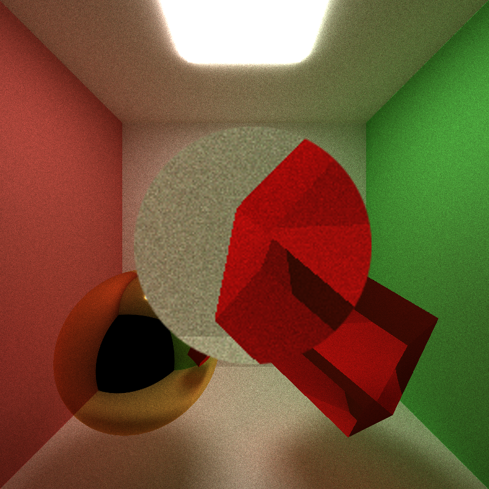 | 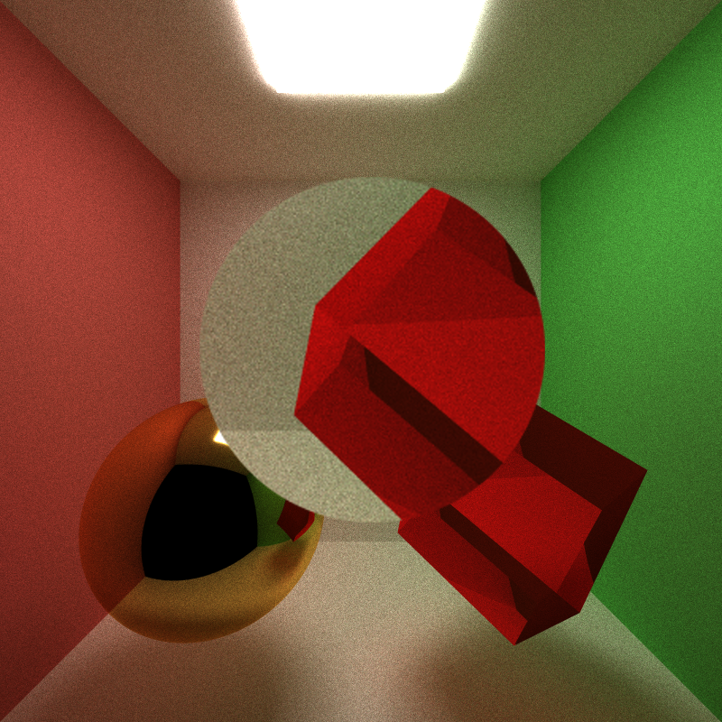
_obersvation_ By jittering the camera ray within the ray's own pixel and performing large number of iterations, the final color of a pixel is computed by averaging all rays going through the pixel, producing antialiased image.

### Performance Analysis
* Trace Depth

Depth | 1 | 2 | 3
:---:|:---:|:---:|:---:
Time | 38 ms | 70 ms | 93 ms
Image |  | 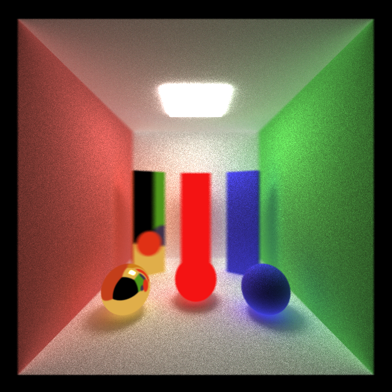 | 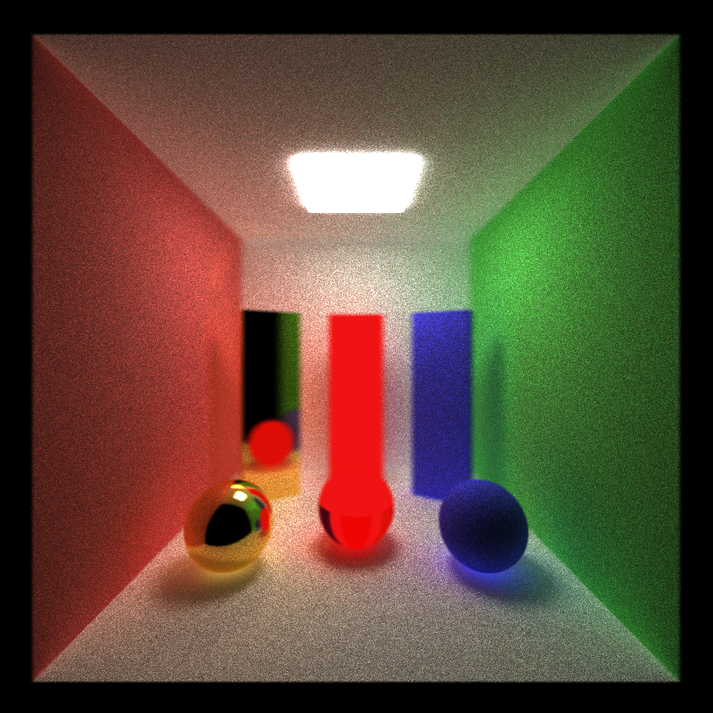
__Depth__ | __4__ | __5__ | __6__
Time | 110 ms | 120 ms | 140 ms
Image | 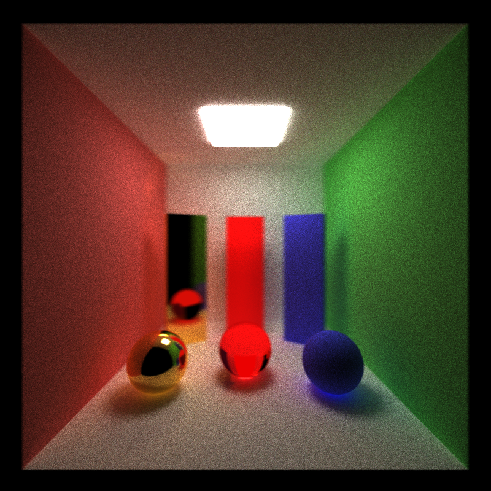 | 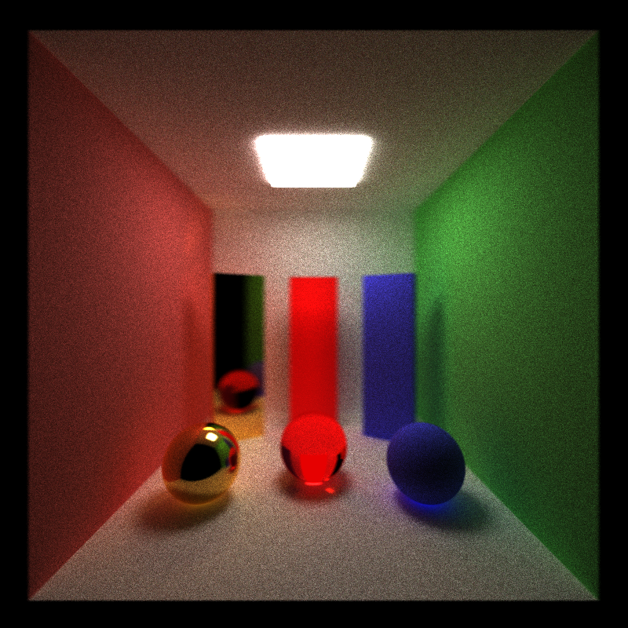 | 
__Depth__ | __7__ | __8__ | __9__
Tim3 | 148 ms | 156 ms | 160 ms
Image | 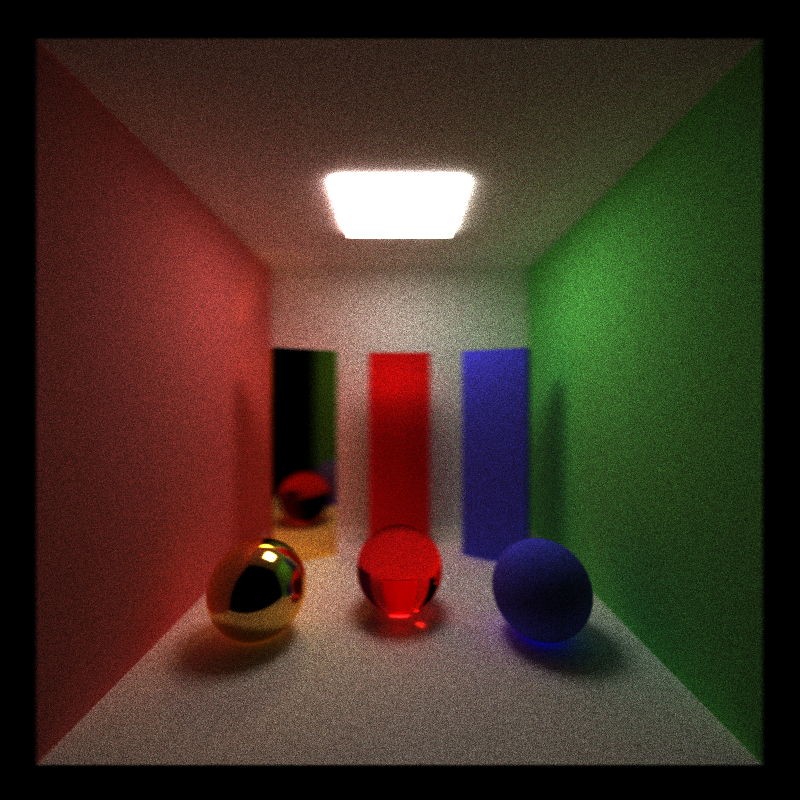 |  | 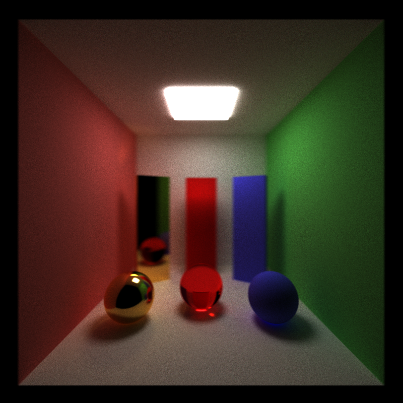

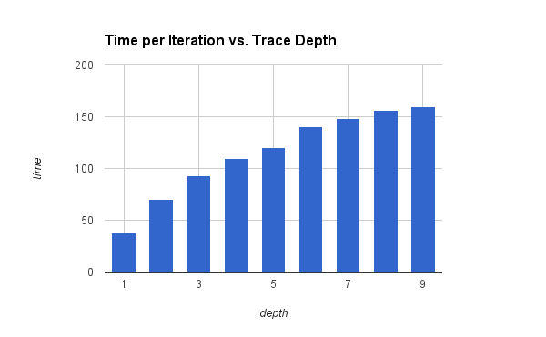

_Observation_ Apparently, as trace depth increases, image quality becomes better. Interestingly, time spent on 1 iteration increases with decreasing rate, that is probably due to the fact that as a ray traces deeper, it is more likely to hit nothing or terminated, thus need no more calculation.
