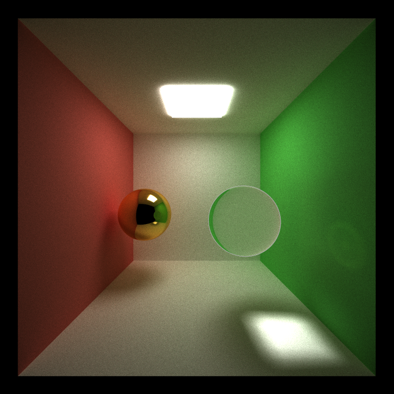

CUDA Path Tracer
================

**University of Pennsylvania, CIS 565: GPU Programming and Architecture, Project 3**

* Liang Peng
* Tested on: Windows 10, i7-6700HQ @ 2.6GHz 2.6GHz 8GB, GTX 960M (Personal Laptop)

### Feature
* [ ] Ray Scattering
  * [x] Diffuse
  * [x] Refraction
  * [x] Specular Reflection
  * [ ] Glossy Reflection
* [ ] Depth of Field
* [x] Stratified Antialiasing
* [ ] Performance Analysis

### Ray Scattering
* Lambert Diffuse

Trace Depth 2, SPP 1000 | Trace Depth 8, SPP 1000
--- | ---
 | 
_observation_ Images rendered with deeper trace level appear darker, which is due to the calculation of ray color. The resulted color is calculated by multiplying the material color of all intersections along the path.

* Refraction

Refraction 1, SPP 1000 | Refraction 2, SPP 1000
--- | ---
 | 
_observation_ Since large amount of paths are traced, caustics produced by refraction are free.

* Specular Reflection

Trace Depth 2, SPP 1000 | Trace Depth 8, SPP 1000
--- | ---
 | 
